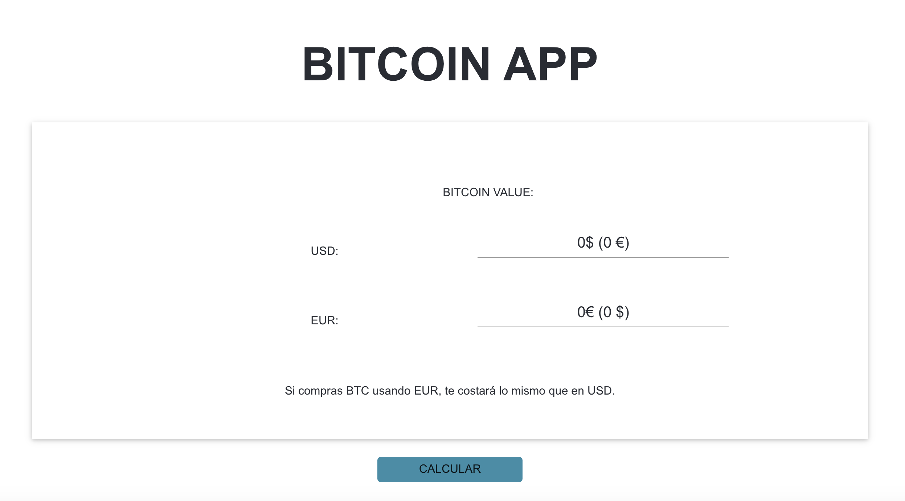

# Bitcoin-App documentation
Bitcoin-app application created with reactJs and Redux.

## Intro

La finalidad de esta aplicación es realizar los cálculos necesarios para saber si la compra de un bitcoin, es mas rentable si se realiza en Euros o en Dolares americanos. Para ello realizamos consultas a dos APIs diferentes que nos aportan los datos necesarios, para posteriormente realizar dichos cálculos.

## ScreenShot




## Getting Started

1. Install the dependencies

```sh
yarn
```

2. Run the application

```sh
yarn start
```

## Documentation used

- redux Toolkit https://redux-toolkit.js.org/tutorials/basic-tutorial
- reselect https://github.com/reduxjs/reselect#installation

## Created by

- [LluisBagur](https://github.com/LluisBagur)


This project was bootstrapped with [Create React App](https://github.com/facebook/create-react-app).
